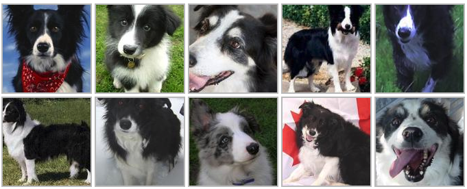

# Dog Breed Identification Deep Learning Project

## Context & Scope

This project aims to build an end-to-end multi-class image classifier to identify dog breeds using TensorFlow 2.0 and TensorFlow Hub.

## Project Data

The data is provided by kaggle as part of the Dog Breed Identification competition, and includes a training set and a test set of images of dogs. Each image has a filename that represents its unique id. The dataset comprises 120 breeds of dogs. The goal of the competition is to create a classifier capable of determining a dog's breed from a photo.

* `train.zip` - the training set, you are provided the breed for these dogs
* `test.zip` - the test set, you must predict the probability of each breed for each image
* `sample_submission.csv` - a sample submission file in the correct format
* `labels.csv` - the breeds for the images in the train set

For more information, visit: https://www.kaggle.com/competitions/dog-breed-identification/data

